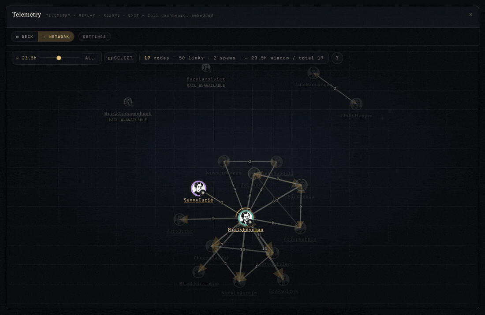
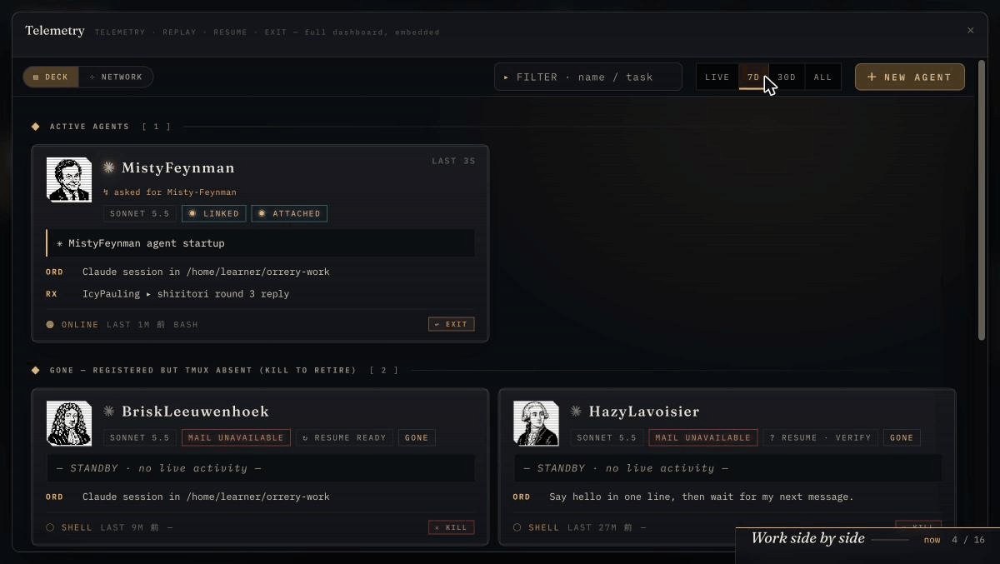

# ORRERY Telemetry

[日本語](README.md)

Multiple Claude Code / Codex agents can talk directly, divide the work, and check each other's results. ORRERY Telemetry shows their work and Mail round trips in one screen. Pair it with [ORRERY cockpit](https://github.com/gyroid-eth/orrery) to use their terminals in the same workspace.



## Install Telemetry only

This repository alone gives you the part that runs behind the scenes. You need Python 3.11 or later, `git`, `tmux`, and `uv` (on a Mac: `brew install tmux uv`). On Windows, run it inside WSL2 Ubuntu.

```bash
git clone https://github.com/gyroid-eth/orrery-telemetry.git
cd orrery-telemetry
./scripts/install.sh --project-key /absolute/path/to/your-project
```

`--project-key` is the absolute path of the folder where agents work (not this repository). The changes are shown and applied only after you confirm. Afterwards, check with `~/.agentstack/bin/agentstack-doctor` and `~/.agentstack/bin/agentstack-selftest`, with Claude Code or Codex CLI installed and signed in in the same environment, start an agent with `~/.agentstack/bin/agent-start <project folder>` for Claude Code or `~/.agentstack/bin/agent-start-codex <project folder>` for Codex CLI, and open `http://127.0.0.1:8770/`. The steps are in the [standalone installation procedure](docs/getting-started.en.md#standalone-installation-and-verification).

Installer `--child-default-tools` selects default child tools (empty by default). Explicit choices win; unavailable default items are omitted with a notice. See [tool selection](docs/delegation.en.md#installer-defaults).

Pass browser or computer use tools to a child with `--tools`. See [reachable tools and what a person does](docs/delegation.en.md#browser-and-computer-use-what-is-reachable-and-what-a-person-does).

At a work boundary, EXIT a child and change its tools in the same conversation with `~/.agentstack/bin/agentstack-resume <NAME> --tools <spec>`. See [changing tools on resume](docs/delegation.en.md#resume-a-stopped-child-with-different-tools).

**What works standalone**: the dashboard's Telemetry screen (DECK, NETWORK, REPLAY, RESUME of retired agents, NEW AGENT), starting agents with `agent-start` or `agent-start-codex`, creating children with the delegate skill (Claude Code: `/delegate`, Codex: `$delegate`), and ORRERY Mail between agents. Agent terminals open in your OS terminal (a Windows Terminal tab on Windows).

**What is not included**: the cockpit screen that arranges and drives terminals in the browser (composer, Split, Planetarium, `ORRERY.app`).

## How it relates to cockpit


- **Telemetry** is what runs agents, Mail, and the dashboard behind the scenes, plus the Telemetry screen that shows their state.
- **[Cockpit](https://github.com/gyroid-eth/orrery/blob/master/README.en.md)** is the screen where you arrange and drive terminals. Starting agents, Mail, and the Telemetry screen are handled by Telemetry, so cockpit is used together with Telemetry (its terminals open even when Telemetry is not running).
- Installing from the cockpit side **installs both.**

## To install both (the orrery one-liner)

Run this in a Mac terminal, or inside WSL2 Ubuntu. It installs cockpit and Telemetry together.

```bash
curl -fsSL https://raw.githubusercontent.com/gyroid-eth/orrery/master/scripts/get.sh | bash
```

Where things go (`~/orrery`, `~/orrery-telemetry`, `~/.agentstack`, `~/orrery-work`), the ports, how to change the work folder, and how to remove everything are in [orrery's README](https://github.com/gyroid-eth/orrery/blob/master/README.en.md#quick-start). To remove a standalone Telemetry, see [Uninstall](docs/install.en.md#uninstall).

## Start with the guides on screen

Try **Your first flight → help map → Full tour** in cockpit. Learn the basics with the seven-item guide on the right on your first visit; look around with `Settings → Getting started → Show help map`; then choose `Full tour` there for sixteen steps in order.

In the Telemetry header, choose `HELP MAP` (beside `SETTINGS` in NETWORK) to annotate the visible DECK / NETWORK controls. In an agent detail panel, choose the `HELP MAP` button in its action row to annotate the panel’s controls. These entries also work when Telemetry is embedded in cockpit. If the annotations do not fit, they appear as a legend; press `Esc` or choose `Close` to dismiss it.

Full tour guides you through creating one child with the delegate skill (Claude Code: `/delegate`, Codex: `$delegate`), playing three shiritori round trips over ORRERY Mail, arranging terminals, and trying Telemetry EXIT / RESUME and NETWORK / REPLAY. Follow the controls described on screen to advance. See the [current quick start](https://github.com/gyroid-eth/orrery/blob/master/README.en.md#quick-start) and [Full tour](https://github.com/gyroid-eth/orrery/blob/master/docs/en/FULL_TOUR.md).

Cockpit is where you work in terminals; Telemetry is where you view the team's status and history. Start with the in-app guides, then use the [documentation index](docs/README.en.md) for detailed references.

## Resume a retired agent

In Telemetry, choose DECK history `7D` / `30D` / `ALL`, or NETWORK's `ALL` range, to find exited agents. Open an agent that can resume and choose **RESUME** in its detail panel to return to the same work. When history, credentials, or the original working directory cannot be verified, the UI explains why and stops the resume.

Standalone Telemetry example: filter by name, find the `RETIRED` / `RESUME READY` agent in `7D`, open it, and choose `RESUME`. After the notification confirms the conversation resumed in tmux, switch to `LIVE` and check that the agent is `ONLINE`.



[Dashboard search and resume](docs/dashboard.en.md#search) and [Launcher Claude resume](docs/launchers.en.md#dashboard-claude-resume) cover cases that need verification and cases that cannot resume.

## Troubleshoot and update

- Not working: run `~/.agentstack/bin/agentstack-doctor` for missing pieces and `~/.agentstack/bin/agentstack-selftest` for Mail round trips, then use [Troubleshooting](docs/troubleshooting.en.md).
- Update: use the orrery one-liner with cockpit, or [Upgrade](docs/install.en.md#upgrade) for standalone Telemetry. See [Uninstall](docs/install.en.md#uninstall) to remove it.
- Windows: [WSL2 setup and sign-in](docs/install.en.md#installing-on-windows-wsl2). Native Windows helpers are a [separate experimental route](docs/windows-local.en.md).
- Environments, terms, and standalone startup: [Getting started](docs/getting-started.en.md).

## Documentation

Japanese documents are the source of truth. The English entry point is the [English index](docs/README.en.md).

| What you want to read | Entry point |
| --- | --- |
| Find material by purpose | [All docs](docs/README.en.md) |
| Start Telemetry on its own or look up a term | [Getting started](docs/getting-started.en.md) |
| Check installation, updates, and requirements | [Installation](docs/install.en.md) |
| Diagnose a problem | [Troubleshooting](docs/troubleshooting.en.md) |

[Using it with Obsidian](docs/obsidian.en.md) and the public [demo vault](https://github.com/gyroid-eth/orrery-demo-vault) turn logs, paper notes, and tasks into notes; Obsidian is optional. [Codex App](docs/codex-app.en.md) and [Antigravity / Gemini](docs/antigravity.en.md) are optional providers beyond the CLIs.

Look before installing with the [public demo](https://agentstack-demo.pages.dev/); the [introduction video](https://youtu.be/Jpc1ad7c90k) illustrates the idea ([Japanese version](https://youtu.be/JXoa93TQolU)). See [CONTRIBUTING.md](CONTRIBUTING.md) before contributing code.

## License

This repository uses the **PolyForm Perimeter License 1.0.1**. It is source-available, not open source in the OSI sense. See [LICENSE](LICENSE) for the complete terms.

- You may use, modify, and redistribute it for any purpose.
- You may **not** provide others with a product that competes with this software. Competing covers free distribution, ports to another language, and delivery as a service, library, or plug-in.

Attribution for inherited or derived portions of the bundled service is recorded in its [NOTICE](packages/agentstack_mail/NOTICE.md), and their license is preserved as [UPSTREAM_LICENSE](packages/agentstack_mail/UPSTREAM_LICENSE). Portions written for ORRERY Telemetry ("AgentStack" in the file name is the former project name) use [AGENTSTACK_LICENSE](packages/agentstack_mail/AGENTSTACK_LICENSE). See [Third-party components](docs/third-party.md) for the boundary.

The scientist portraits on the dashboard (`dashboard/portraits_pixel/` and its 64 px reductions in `dashboard/portraits_64/`) are pixel art generated by the author (gyroid) with ChatGPT image generation from text prompts only; no photographs were used as input. They are distributed under the same terms as the repository. Their provenance is recorded in [Third-party components](docs/third-party.md#肖像画像).
