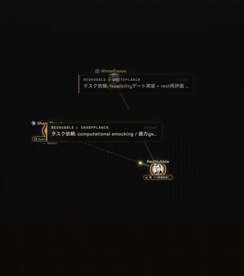

# claude-agent-stack



A coordination layer + live telemetry dashboard for running multiple
[Claude Code](https://docs.claude.com/en/docs/claude-code) (and Codex) agents on one machine.

It sits **on top of** [`mcp_agent_mail`](https://github.com/Dicklesworthstone/mcp_agent_mail)
(inter-agent messaging + file reservations) and adds:

- **Live dashboard** — see every tmux-resident agent, what it's working on, its
  context budget, parent/child spawn lineage, and agent-to-agent communication,
  updated in real time. Click an agent to jump to its terminal window.
- **Coordination hooks** for Claude Code — file-reservation guard, agent
  registration gate, child-agent spawning, and a mail watcher that injects
  inbox signals back into each agent's terminal.
- **Bundled skills** — `/delegate` (spawn and supervise a child agent) and
  `/log` (write a structured session log), registered with Claude Code at
  install time. See [Skills](#skills).
- **One-command install** — `./install.sh` clones agent-mail, wires up the
  config, and starts the dashboard (macOS launchd / Linux systemd / plain nohup).
  The default Tier1 path shows dry-run diffs/previews and waits for an explicit
  `yes` before adding the recommended managed hook, Codex `AGENTS.md`, and
  Claude `CLAUDE.md` entries.


## Works best with Obsidian

This stack is usable with any project, but it **shines when your knowledge base
runs on [Obsidian](https://obsidian.md/)**. The coordination layer was designed
alongside an Obsidian vault, and the `/log` skill (phase 4) writes structured
work logs directly into your vault — complete with Daily Note backlinks, graph
connections, and tag-based maturity tracking.

Without Obsidian, logs fall back to a `logs/` directory in the current working
directory. All other features (dashboard, hooks, agent-mail) work regardless.

If you use Obsidian, set `AGENTSTACK_PROJECT_KEY` to your vault path and point
`AGENTSTACK_OBSIDIAN_APP` at the Obsidian CLI binary:

```bash
export AGENTSTACK_PROJECT_KEY="$HOME/path/to/your-vault"
export AGENTSTACK_OBSIDIAN_APP="/Applications/Obsidian.app/Contents/MacOS/obsidian"
```

## Requirements

- `python3`, `tmux`, `git`, and `uv` (for agent-mail)
- macOS or Linux (see [Windows / WSL2](#windows--wsl2) below)
- [Obsidian](https://obsidian.md/) *(recommended — unlocks full log integration)*
- [Ghostty](https://ghostty.org/) *(recommended — enables click-to-jump and auto window titles; falls back to iTerm2 → macOS Terminal → none automatically)*
- [`fzf`](https://github.com/junegunn/fzf) *(optional — lets `agent-start` browse a vault for the working directory; without it, pass a path explicitly)*

## Quick start

```bash
git clone <this-repo> && cd claude-agent-stack
./install.sh
# open http://127.0.0.1:8770/
```

The default Tier1 install recommends all three coordination surfaces:
Claude Code hooks in `~/.claude/settings.json`, Codex instructions in
`~/.codex/AGENTS.md`, and Claude instructions in `CLAUDE.md`. Each write is
shown as a dry-run/preview first and only applied after typing `yes`; existing
files are preserved with timestamped backups and idempotent managed blocks.

The dashboard binds to `127.0.0.1` by default. For access from a trusted LAN or
VPN, set `AGENTSTACK_BIND_HOST=0.0.0.0`; this exposes control endpoints and the
terminal bridge to that network.

## Upgrading from an earlier install

Recommended in-place upgrade:

```bash
cd claude-agent-stack
git pull
./install.sh
```

The installer copies the current launcher, dashboard, hook, skill, Codex, and
Claude template payloads over the existing install, restarts the dashboard
service (`bootout` then `bootstrap` on launchd, or the equivalent service start
path on other platforms), re-runs the settings safe-merge preview/consent flow,
and updates the Codex `AGENTS.md` and Claude `CLAUDE.md` managed blocks
idempotently after consent. Finish with:

```bash
~/.agentstack/bin/agentstack-doctor
```

If the install looks unhealthy, do a clean reinstall while keeping agent-mail
data:

```bash
~/.agentstack/bin/agentstack-uninstall
./install.sh
```

Existing registered agents keep their old names. New `agent-start` and
`agent-start-codex` sessions receive `Adjective-Scientist` names such as
`Swift-Bohr`; no migration is needed. Names are generated by
claude-agent-stack itself, so updating the agent-mail upstream clone is not
required for this feature. Running sessions keep the launcher code they started
with; restart those Claude/Codex sessions to pick up new launcher behavior.
This upgrade does not rely on removed payload files, so no stale-file cleanup
is needed.

## Launching agents

For the dashboard to list an agent and let you click-to-jump to it, the agent
must run **inside a named tmux session**. The installed `agent-start` launcher
(in `~/.agentstack/bin`) does exactly that: from outside tmux it replaces the
current terminal tab with a fresh tmux session and runs `claude` inside it.
Before Claude starts, the launcher registers the session with
agent-mail using an explicit `Adjective-Scientist` name such as `Swift-Bohr`;
the dashboard matches the scientist suffix to show the bundled portrait. If
the launcher cannot reach agent-mail, it still exports that name as
`AGENT_NAME` so Claude can register the same name through its MCP client.

The single hyphen makes these names explicit IDs for stock `mcp_agent_mail`,
so the default coerce mode honors them as written. The suffix remains a bundled
scientist key, so dashboard portrait matching still works without any
agent-mail name-mode override.

```bash
# add the launcher to your PATH (e.g. in ~/.zshrc or ~/.bashrc)
export PATH="$HOME/.agentstack/bin:$PATH"

agent-start ~/code/my-project   # run claude in that directory
agent-start                     # pick a directory interactively (needs fzf)
```

### Pick a working directory from your vault

Set `AGENTSTACK_BASE_DIR` to the root you want the interactive picker to browse
(defaults to `$HOME`). Point it at your Obsidian vault to drill into a subfolder
without typing the path:

```bash
export AGENTSTACK_BASE_DIR="$HOME/Obsidian/MyVault"
```

Then `agent-start` (no argument) opens an `fzf` browser rooted there:

- **→** descend into the highlighted directory · **←** go to parent (stops at the base)
- **Enter** select the highlighted directory · **Esc** cancel

Without `fzf`, `agent-start` falls back to the current directory; pass a path
explicitly (`agent-start PATH`) to be precise.

### Other launcher options

| Variable | Default | Purpose |
| --- | --- | --- |
| `AGENTSTACK_BASE_DIR` | `$HOME` | Root the interactive picker browses |
| `AGENTSTACK_CLAUDE_BIN` | `claude` | Path to the `claude` binary |

If you launch `agent-start` from **inside** an existing tmux session, it runs
`claude` in place and renames the current session after registration instead of
starting a new tmux session.

### Codex agents

`agent-start-codex` is the [Codex CLI](https://github.com/openai/codex)
counterpart. It takes the same directory selection (`AGENTSTACK_BASE_DIR`,
explicit path, or fzf). Because Codex has no hook system, the launcher runs
`agentstack-codex-bootstrap` inside the session to register the agent with
agent-mail using an explicit `Adjective-Scientist` name before starting Codex.
The same suffix matching drives dashboard portraits. If the shell registration
path is unavailable, the bootstrap still exports the preselected name as
`AGENT_NAME`; Codex can then register it through its MCP client.

```bash
agent-start-codex ~/code/my-project
agent-start-codex                     # pick a directory (needs fzf)
```

| Variable | Default | Purpose |
| --- | --- | --- |
| `AGENTSTACK_CODEX_BIN` | `codex` | Path to the `codex` binary |
| `AGENTSTACK_VAULT` | *(unset)* | Extra writable dir passed as `codex --add-dir` |
| `AGENTSTACK_CODEX_SANDBOX` | `workspace-write` | `codex --sandbox` value |
| `AGENTSTACK_CODEX_APPROVAL` | `on-request` | `codex --ask-for-approval` value |

Registration needs a running agent-mail (the install sets this up) and
`AGENTSTACK_PROJECT_KEY`; without them Codex still launches with a preselected
`Adjective-Scientist` `AGENT_NAME`, just without shell-side registration.
`OPENAI_API_KEY` is stripped at launch so Codex uses its ChatGPT OAuth login.

#### Identity registration is token-strict

Stock agent-mail requires the original `registration_token` when re-registering
an existing agent name. Read-only calls such as `fetch_inbox` and `whois` are
also token-gated for an existing identity unless the same MCP session has
already authenticated as that agent. The launchers keep that token in
`CHILD_REGISTRATION_TOKEN` and persist it under the runtime directory. Top-level
sessions use `agent_token_<name>`:

```bash
${AGENTSTACK_RUNTIME_DIR:-$HOME/.claude/runtime}/agent_token_<name>
```

Delegated children also have child runtime state:

```bash
${AGENTSTACK_RUNTIME_DIR:-$HOME/.claude/runtime}/child-agents/<name>.json
```

`agentstack-reregister` reads both locations. In pre-registered delegate flows,
`spawn_child.sh --pre-registered` requires a child-owned token file or existing
`child-agents/<name>.json` state; it does not forward the parent's ambient
`CHILD_REGISTRATION_TOKEN`.

The `CHILD_` prefix is historical: this is the re-authentication token for
continuing an existing identity, not only a child-agent token. If
`CHILD_REGISTRATION_TOKEN` is available, pass it as `registration_token`; if it
is missing, omit `registration_token` rather than inventing a new one for an
existing name.

Claude sessions also have a SessionStart hook that can re-register an existing
identity from the persisted token before the model starts work. Codex sessions
do not have that hook, so the managed Codex instructions start with:

```bash
AGENTSTACK_PROJECT_KEY="/path/to/project" ~/.agentstack/bin/agentstack-reregister "$AGENT_NAME"
```

That helper reads the token from runtime state and calls agent-mail without
printing the token to the transcript. It also supports Claude recovery with
`agentstack-reregister "$AGENT_NAME" claude-code`. After it succeeds, continue
with `fetch_inbox(agent_name="$AGENT_NAME")`; do not call `register_agent`
again.

Registration also sets the agent's `contact_policy` to `open` by default so
single-operator meshes can send first messages without an idle approval gate.
Override with `AGENTSTACK_CONTACT_POLICY=auto`, `contacts_only`, `block_all`, or
`closed`; set it to an empty value or `skip` to leave the server default alone.

## Skills

The installer copies the bundled skills to `~/.agentstack/skills` and registers
that directory in Claude Code's `skillsDirectories`, so the slash commands below
are available in any Claude Code session (no manual symlinking). Both are
env-driven - they read `AGENTSTACK_*` from the install, not hard-coded paths.

### `/delegate` — spawn and supervise a child agent

Hands a bounded task to a child Claude (or Codex) agent and keeps the parent
responsible for the outcome: it writes a risk profile, reserves files to avoid
collisions, spawns the child via `spawn_child.sh`, annotates it in the
dashboard, monitors progress, and reports a verified result.
Pre-registered children should be created through
`bin/agentstack-preregister-child`, then launched with
`spawn_child.sh --pre-registered --child-token-file <file>` so the parent LLM
does not handle the child token and the parent's token is not forwarded.

```bash
/delegate "<task>"                       # child Claude agent in the current project
/delegate "<task>" --dir <directory>     # run the child elsewhere
/delegate "<task>" --codex               # use a Codex child instead
/delegate "<task>" --model <model-name>  # pick the child's model
/delegate "<task>" --worktree            # isolate the child in a git worktree
```

The child appears in the dashboard with its spawn lineage, and completion is
delivered back to the parent over agent-mail.

### `/log` — structured session log

Writes a structured log of the current session. If `AGENTSTACK_PROJECT_KEY`
points at an Obsidian vault, the log lands there with daily-note backlinks and
graph connections; otherwise it falls back to a local `logs/` directory.

```bash
/log <theme> [project]
```

### Managed agent instructions

The slash commands above are a Claude Code feature. Claude gets the shared
coordination rules from hooks plus `CLAUDE.md`; Codex gets equivalent rules from
its global `~/.codex/AGENTS.md`. The default installer offers both managed
blocks. Re-run them any time after upgrading the stack:

```bash
~/.agentstack/bin/agentstack-codex-setup      # managed block in ~/.codex/AGENTS.md
~/.agentstack/bin/agentstack-claude-setup     # managed block in project CLAUDE.md
```

Both setup commands are idempotent, preserve existing content, write a
timestamped backup before changing a file, support `--print`, and support
`--uninstall`. `agentstack-claude-setup` writes the project `CLAUDE.md` by
default, where the project root is `AGENTSTACK_PROJECT_KEY`; set
`AGENTSTACK_CLAUDE_MD_SCOPE=global` for `~/.claude/CLAUDE.md` or `both` for both
targets.

The managed blocks point agents at `~/.agentstack/skills/<name>/SKILL.md` and
spell out the startup discipline: use the shared project key, register/fetch
inbox, obey parent task messages, and reserve files before editing.

## Collision prevention (file reservations)

Agents on one machine share a **file-reservation registry** (provided by
`mcp_agent_mail`): before editing a file an agent reserves its path, so two
agents don't clobber the same file. Reservations are taken, renewed, and
released over agent-mail and are visible in the dashboard.

Enforcement differs by agent type:

- **Claude Code agents are hard-enforced.** The `check-file-reservation.sh`
  PreToolUse hook blocks `Edit`/`Write` under the protected roots
  (`AGENTSTACK_PROTECTED_ROOTS`, default the project key) unless a current
  reservation exists.
- **Codex agents are not auto-blocked** — Codex has no hook system, so it must
  reserve voluntarily. `agentstack-codex-setup` writes that discipline into
  `~/.codex/AGENTS.md` (reserve before editing, renew long edits, release when
  done). Run it so Codex-heavy setups stay collision-safe.
- **Claude instructions are mirrored in CLAUDE.md.** `agentstack-claude-setup`
  writes the same startup and reservation discipline into the selected
  `CLAUDE.md` target without overwriting existing content.

Either way the underlying registry is shared, so a Claude reservation is visible
to Codex and vice versa — the difference is only whether editing is *blocked*
or *expected* without one.

## Windows / WSL2

Native Windows is not supported. On Windows, run everything inside
**WSL2** (Ubuntu 22.04+ recommended).

### 1. Install WSL2 and Ubuntu

```powershell
# Run in PowerShell (Admin)
wsl --install
# Restart when prompted, then open "Ubuntu" from the Start menu
```

### 2. Install dependencies inside WSL2

```bash
sudo apt update && sudo apt install -y python3 python3-pip tmux git curl
# uv (fast Python package manager, needed for agent-mail)
curl -LsSf https://astral.sh/uv/install.sh | sh
```

### 3. Install Claude Code inside WSL2

```bash
npm install -g @anthropic-ai/claude-code
```

If `node` / `npm` is missing:

```bash
curl -fsSL https://deb.nodesource.com/setup_lts.x | sudo -E bash -
sudo apt install -y nodejs
```

### 4. Install claude-agent-stack

```bash
git clone <this-repo> && cd claude-agent-stack
./install.sh
```

The installer detects Linux and uses **systemd user units** (if available)
or a plain **nohup** fallback to keep the dashboard running.

### 5. Open the dashboard from Windows

The dashboard runs at `http://127.0.0.1:8770/` inside WSL2.
Open that URL in your **Windows browser** — WSL2 automatically forwards
localhost ports to Windows.

### Known limitations on WSL2

- **Ghostty is not available on WSL2.** The dashboard auto-detects this and
  sets `AGENTSTACK_TERMINAL=none`, which disables click-to-jump. You can still
  reach any agent manually with `tmux attach -t <name>` inside WSL2.
- Obsidian on Windows cannot directly read a vault that lives inside the WSL2
  filesystem (`\\wsl$\...`). Either keep your vault on the Windows filesystem
  and mount it in WSL2 (`/mnt/c/...`), or run Obsidian inside WSL2 with an
  X server / WSLg.

## Personal portrait overlays

The repository keeps bundled dashboard portraits generic. To use local portraits
without committing personal files, point the dashboard at a private PNG directory
and a private name-to-portrait JSON file:

```bash
export AGENTSTACK_PORTRAITS_DIR="$HOME/.agentstack/portraits_64"
export AGENTSTACK_CUSTOM_PORTRAITS="$HOME/.agentstack/custom_portraits.json"
```

Place `mybot.png` in the overlay directory, then map the lowercased registered
agent name to that portrait key:

```json
{"mybot":"mybot"}
```

See `examples/custom_portraits.example.json` for a neutral template. When these
environment variables are unset, the dashboard uses only the bundled portraits.

## Troubleshooting

### Agent registration or inbox read fails

Symptoms:

- The agent cannot register.
- `fetch_inbox` or `whois` returns an authentication error.
- The inbox appears empty even though the parent or operator sent a task.
- Agent-mail reports `requires registration_token` for an existing name.
- The dashboard or telemetry shows an identity split: the terminal title and
  active agent disagree, or a new alias appears instead of the expected name.

Cause:

- Stock agent-mail is token-strict for existing names. Re-registering an
  existing identity requires the original `registration_token`.
- If `CHILD_REGISTRATION_TOKEN` is missing, the persisted runtime token is
  missing, or either token is stale, same-name registration is rejected.
- Read-only calls are also token-gated for existing identities, so trying
  `fetch_inbox` before recovery can fail with the same token error.

Fix:

- Do not register under a different name to get unstuck; that creates a split
  identity and loses the existing inbox/thread continuity.
- Claude sessions normally recover through the SessionStart hook, which
  restores the persisted token and re-registers before the model starts work.
- Codex sessions normally recover by running
  `agentstack-reregister "$AGENT_NAME"`, which reads runtime state and calls
  agent-mail without printing the token.
- If recovery still fails, check runtime state for the expected agent:
  top-level sessions use `agent_token_<name>`, while delegated children use
  `child-agents/<name>.json`. If the token file is missing or stale, report
  that condition to the parent/operator instead of inventing a new token or
  alias.
- If the visible `CHILD_REGISTRATION_TOKEN` exists but still fails, suspect a
  wrong token, such as a parent token that leaked into a pre-registered child.
  Re-run `agentstack-reregister`; if that cannot restore from runtime state,
  restart with the correct child-owned token file/state and report the mismatch.
- If the name itself belongs to another token, treat it as a name conflict. Do
  not hard-delete or claim the name unless the operator explicitly approves it.
- Interpret the inbox result carefully: an empty inbox after successful
  authentication is normal; an auth error means registration recovery is still
  needed; a response under a different name means identity split risk.

Token diagnosis quick flow:

| Symptom | Check | Recovery |
| --- | --- | --- |
| No visible token | Run `agentstack-reregister "$AGENT_NAME"`; check `agent_token_<name>` or `child-agents/<name>.json` exists | Restore from runtime state, or report missing token to the parent/operator |
| Wrong token | Env token exists but strict registration still fails; for children, compare against `child-agents/<name>.json` state | Restart or re-run with the correct child-owned token file/state; do not forward a parent token |
| Stale token | Runtime token exists but no longer matches the server identity | Report stale token and restart/re-register from the operator-approved token source |
| Name conflict | The expected name belongs to another token or agent | Stop; do not create a new alias or hard-delete without explicit operator approval |

### Mouse wheel scrolls the terminal, not tmux scrollback

Every agent runs **inside a tmux session**, so to scroll back through an
agent's output you need tmux's mouse mode enabled. Without it the wheel
scrolls Ghostty's (or iTerm2 / Terminal's) own buffer instead — which looks
broken because tmux owns the screen and you can't reach the agent's history.

Add this to `~/.tmux.conf` (create the file if it doesn't exist):

```tmux
set -g mouse on            # wheel scrolls tmux scrollback
set -g history-limit 50000 # keep more scrollback
setw -g mode-keys vi       # vi-style copy-mode keys
```

Reload it without restarting: `tmux source-file ~/.tmux.conf` (or just launch
a new agent). Keyboard alternative that needs no config: `Ctrl+b [` enters
copy-mode — scroll with the arrow keys / PageUp / PageDown, then `q` to exit.

`scripts/doctor.sh` prints a hint when mouse mode looks off.

## License

Copyright (c) 2026 gyroid. All rights reserved.

This software is provided for personal use by authorized recipients only.
Redistribution, sublicensing, or commercial use without explicit written
permission from the author is prohibited.

`mcp_agent_mail` is a separate upstream dependency fetched at install time
and carries its own license.
