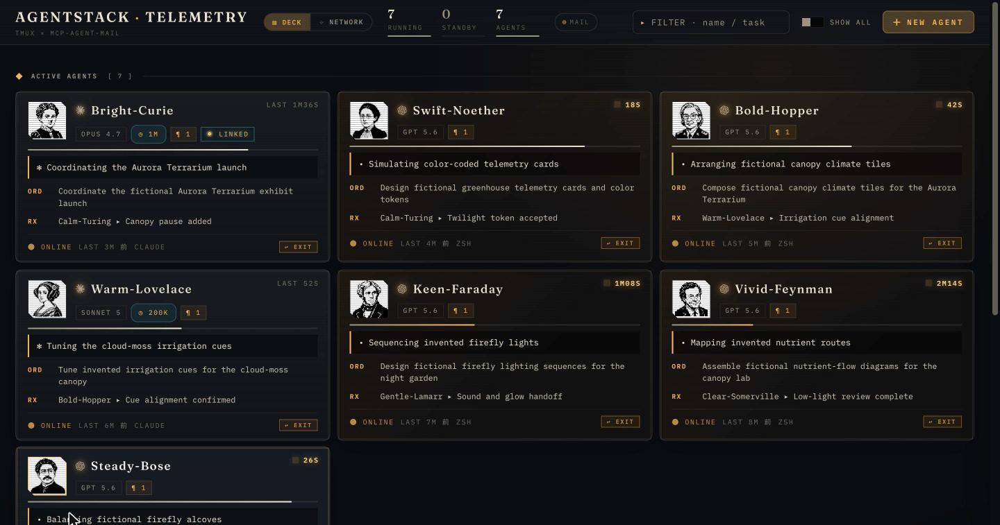
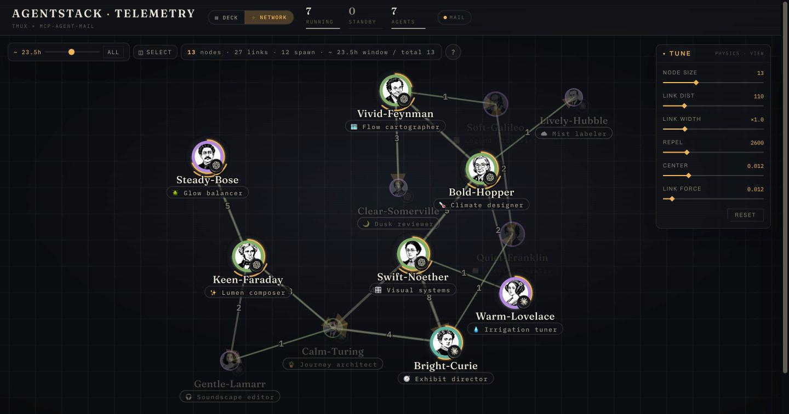
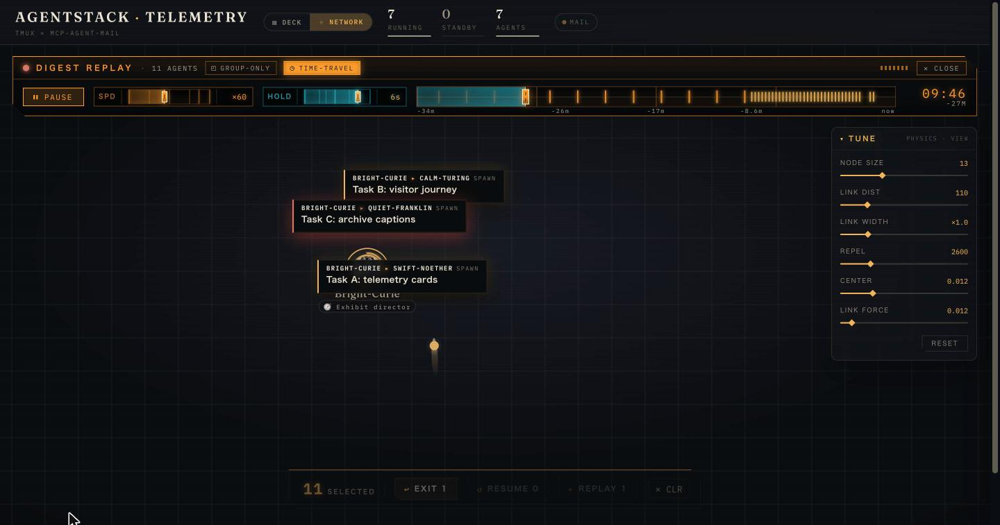
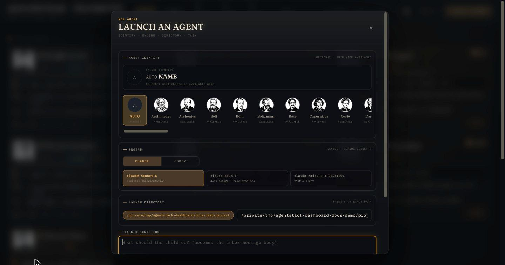

# claude-agent-stack

[English](README.en.md)

ローカルで動く Claude Code / Codex エージェント群のための、協調基盤とライブ telemetry ダッシュボードです。[mcp-agent-mail](https://github.com/Dicklesworthstone/mcp_agent_mail) をメッセージ・identity・file reservation の正本にし、tmux 上の実行状態、親子関係、通信履歴、コンテキスト残量を一つの画面に重ねます。


設計の中心は「LLM に協調を期待するだけでなく、launcher・hook・mail・可視化で運用規約を実行可能にする」ことです。

## 動作要件

- macOS（主対象。launcher / hook は標準 Bash 3.2 対応）
- Python 3.10 以上（`python3`）、`tmux`、`git`、`uv`
- Claude Code または Codex CLI
- `fswatch`（任意。mail watcher。なければ polling）
- `fzf`（任意。directory picker）
- Ghostty（推奨。iTerm2、Terminal.app、`none` へ fallback）
- Obsidian（任意。`/log` の vault / Daily Note 統合と、vault 内 Output item を開く link。未導入でも generic project の `logs/` は Output に表示できます。`/log` の vault mode には `AGENTSTACK_OBSIDIAN_APP` が必要）

macOS では launchd の `gui/$UID` domain への bootstrap を試し、画面スリープ中や SSH 専用環境などで利用できなければ自己再起動付きの background supervisor へ切り替えます。Linux では systemd user service、利用できなければ同じ background supervisor を使います。Windows native は対象外です。詳しくは[インストール](docs/install.md#動作環境)を参照してください。

## クイックスタート

```bash
git clone https://github.com/gyroid-eth/claude-agent-stack.git
cd claude-agent-stack
./scripts/install.sh
```

installer の preview を確認し、Claude Code settings と managed instructions の merge を許可します。インストール後:

```bash
export PATH="$HOME/.agentstack/bin:$PATH"

agent-start ~/code/my-project
# または
agent-start-codex ~/code/my-project
```

別の terminal で dashboard を開きます。

```bash
open http://127.0.0.1:8770/
~/.agentstack/bin/agentstack-doctor
```

`agent-start` は agent-mail identity と同名の tmux session を作ります。これが dashboard の jump、mail signal 配送、token recovery を一意に結びます。設定を変える場合は[インストール](docs/install.md)と[設定](docs/configuration.md)を参照してください。

Codex Desktop の root task / subagent も同じ agent-mail と dashboard に接続する場合は、任意の [Codex App 統合](docs/codex-app.md)を追加します。Codex CLI だけを使う場合、この追加 install は不要です。

## 機能ギャラリー

### 1. Launcher と identity

`agent-start` / `agent-start-codex` が identity 登録、科学者名、tmux session、CLI 起動を一つの経路にまとめます。token は mode `0600` の runtime file に置き、継承環境からの identity hijack を防ぎます。

<!-- TODO: screenshot: launcher and registered agent -->

### 2. Hook、mail、file reservation

Claude Code hook が未登録 session と競合書き込みを止め、agent-mail inbox signal を Claude / Codex REPL へ再注入します。mail と reservation の正本を一つに保つため、UI を再起動しても協調状態が分裂しません。

<!-- TODO: screenshot: agent-mail notification and reservation -->

### 3. DECK

カードごとに running / standby / finished / gone、task、model、context 残量、最後の指示、成果物を表示します。History / Output、terminal open、二段確認付き EXIT / KILL を同じ場所から操作できます。



### 4. NETWORK と DIGEST REPLAY

spawn 系譜と agent-mail 通信を force graph に重ね、node、edge、role / group、mail drawer を探索できます。複数 agent を選ぶと、通信と状態遷移を速度・HOLD・TIME-TRAVEL 付きで再生できます。





### 5. Control plane と NEW AGENT

dashboard から EXIT、RESUME、REPLAY、role annotation、Claude / Codex child spawn を実行できます。登録、task 配送、token file、tmux 起動を一つの監査可能な順序に固定します。



### 6. API とカスタマイズ

dashboard の全表示・操作は local HTTP API から利用できます。portrait overlay、spawn directory、model catalog、terminal bridge を環境変数で構成でき、private asset は repository と分離できます。

murmur は browser の言語から日本語 / 英語を自動選択し、`?lang=` / `AGENTSTACK_LANG` で上書き、`?murmur=on|off` / `AGENTSTACK_MURMUR=off` で表示を制御できます。

<!-- TODO: screenshot: API or customized portraits -->

## ドキュメント

日本語文書が正本です。英語版の詳細文書は準備中です。

| 文書 | 内容 |
| --- | --- |
| [インストール](docs/install.md) | install tier、settings merge、VERSION、TCC、upgrade / uninstall |
| [Launcher と identity](docs/launchers.md) | `agent-start`、命名、token、fail-closed、`CLAUDECODE` |
| [Hooks と運用 helper](docs/hooks.md) | Claude event hook 5件、launcher / watcher helper 6件、発火条件、block / cleanup |
| [Codex App 統合](docs/codex-app.md) | Codex Desktop plugin、Bridge、session-bound MCP、inbox 通知、cold wake |
| [Dashboard](docs/dashboard.md) | DECK、NETWORK、SELECT、REPLAY、NEW AGENT、embed |
| [API reference](docs/api.md) | 全 route、query / request、response schema |
| [設定](docs/configuration.md) | `AGENTSTACK_*` 環境変数とカスタマイズ |
| [トラブルシューティング](docs/troubleshooting.md) | `NOT CONFIGURED`、service、通知、spawn、認証 |
| [第三者コンポーネント](docs/third-party.md) | agent-mail、license、credits |

コードへ変更を送る場合は [CONTRIBUTING.md](CONTRIBUTING.md) も参照してください。

## 仕組み

```text
Claude Code / Codex CLI
        │ launcher + hooks
        ▼
tmux session ── telemetry ──► dashboard
        │                         ▲
        │                         │ sanitized snapshot
        │                  Codex App Bridge ◄── plugin hooks ── Codex Desktop
        │                         │
        └──────── mcp-agent-mail ◄┘
                  identity / inbox / reservations
```

agent-mail を置き換えるのではなく、その上に launcher、運用 guard、可視化、control plane を重ねます。dashboard が落ちても identity・mail・reservation の正本は失われません。

## License

本 repository は **PolyForm Perimeter License 1.0.1** です。source-available であり、OSI の意味での open source ではありません。全文は [LICENSE](LICENSE) を参照してください。

- 利用・改変・再配布は目的を問わず可能です
- ただし**本ソフトウェアと競合する製品を他者へ提供すること**はできません。無償配布・別言語への移植・service / library / plug-in としての提供も競合に含まれます

別 component の `mcp_agent_mail` は upstream の license に従います（本 repository の license は及びません）。分離方針と正確な参照先は[第三者コンポーネント](docs/third-party.md)にまとめています。
