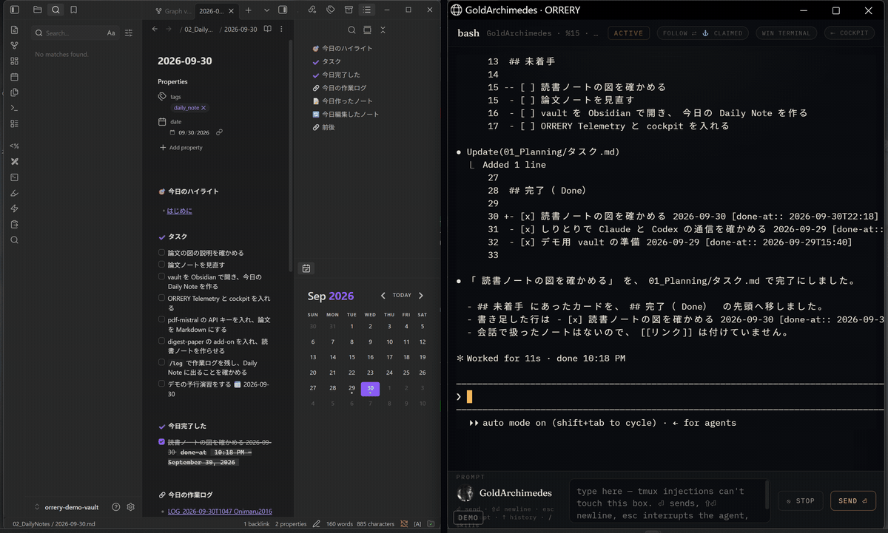

# Obsidian と一緒に使う

> English version: [obsidian.en.md](obsidian.en.md)

[README に戻る](../README.md)

ORRERY Telemetry は Obsidian が無くても使えます。このページは、Obsidian の vault を作業場所にすると便利になる、使い方の 1 つを紹介します。

## 何が便利か

- **agent の成果物が、そのまま Markdown のノートになる**
  - `/log` の作業ログ: その session で何を決め、何を変え、何を確かめたか
  - [digest-paper](https://github.com/gyroid-eth/orrery-digest-paper)（ORRERY の add-on）の論文ノート: Claude が書き、Codex が本文と図に照らして確かめたもの
  - `/addtodo`・`/adddone` のタスク: Kanban ボードのカード
- **人は Obsidian で見るだけでよい**
  - Daily Note は、Dataview でその日の作業ログと完了したタスクを自動で並べる。agent がログを書けば、その日の Daily Note にリンクが増える
  - Kanban ボードで、タスクの進み具合が見える。カードにチェックを入れると完了時刻が付き、完了の列へ移る
- **cockpit から開ける**: [ORRERY cockpit](https://github.com/gyroid-eth/orrery) の端末に agent が出したノートのパスは、クリックで Finder（Windows ではエクスプローラー）に開ける

## 始め方

### (a) demo vault をひな形にする

[gyroid-eth/orrery-demo-vault](https://github.com/gyroid-eth/orrery-demo-vault) は、上のことがすぐ試せる vault です。

- Daily Note のテンプレート（今日のタスク・今日完了・今日の作業ログを Dataview で表示）
- Kanban のタスク板（`01_Planning/タスク.md`）と、完了時刻を付けるプラグイン（Task Done At）
- agent 用の skill: `/log`（`05_Agents/` に作業ログ）、`/addtodo`・`/adddone`（Kanban のカード）
- 人用の QuickAdd のマクロ「タスク追加」
- `CLAUDE.md` / `AGENTS.md`（agent がこの vault で守る決まり）
- digest-paper で使う PDF の変換プラグイン（pdf-mistral）と、試しに使える CC BY の論文 1 本

ダウンロードして Obsidian で開き、`00_Inbox/はじめに.md` の順に進めます。

### (b) 自分の vault に入れる

いまの vault に足すときは、demo vault から次をコピーします。

1. `.claude/skills/log`・`addtodo`・`adddone` を、自分の vault の `.claude/skills/` に
2. `30_Templates/Daily Note.md` を、自分の Daily Note のテンプレートに（`05_Agents` と `01_Planning` のフォルダ名は、自分の vault に合わせて書き換える）
3. `CLAUDE.md`（Codex を使うなら `AGENTS.md`）に、ログとタスクの置き場を書く
4. Obsidian のコミュニティプラグイン Dataview・Kanban・Templater を入れる（完了時刻を自動で付けたいときは、demo vault の Task Done At も）

agent は vault のフォルダで起動します（`cd <vault> && claude`）。demo vault では、agent は vault の `CLAUDE.md` と skill の決まりに従って `05_Agents/` にログを書きます（下の実例で確認）。vault の skill を使わず、ORRERY Telemetry に同梱の `/log` で vault に書きたい場合は、[設定の Skill](configuration.md#skill) にある `AGENTSTACK_OBSIDIAN_APP` を使います。

## 実例（2026-09-29、Windows の WSL2 で確認）

demo vault を Windows のフォルダに置き、Windows の Obsidian で開いて、WSL2 の中の agent と次の流れを通しました。

1. Obsidian の pdf-mistral で、論文の PDF を Markdown と図にする
2. WSL の Claude に digest-paper を頼む。Codex の確かめ役とのやり取りを経て、ノートが `review_status: checked` で vault の `10_Reference/Notes/` に保存される
3. WSL の Claude に `/log` と打つ。`05_Agents/LOG_<日時> <テーマ>.md` ができ、Windows の Obsidian の Daily Note の「今日の作業ログ」に自動で出る
4. Obsidian の「タスク追加」（または agent の `/addtodo`）でカードを足し、agent に `/adddone` と言うと、そのカードが完了の列に移り、Daily Note の「今日完了した」に出る

## Mac と Windows（WSL2）の注意

- **Mac**: vault は普段の場所（例 `~/Documents/MyVault`）に置き、その中で agent を起動します
- **Windows**: vault は Windows のフォルダ（例 `C:\Users\<あなた>\Documents\MyVault`）に置き、Windows の Obsidian で開きます。agent は WSL2 の中で、そのフォルダを `/mnt/c/Users/<あなた>/Documents/MyVault` として使います（`wslpath -u 'C:\Users\...'` で変換できる）
- **digest-paper の作業中のもの**（下書き・図・レビュー）は、WSL 側の `~/.agentstack/addons/digest-paper/runs/` に置かれます。vault に書かれるのは、完成したノートと、その確認の記録（`evidence/`）だけです
- **dashboard の Output**: dashboard の card の Output は、project の `logs/` にある `LOG_*.md` を並べます（[設定](configuration.md)）。demo vault のように `05_Agents/` にログを書く vault では、Output ではなく Obsidian の Daily Note で見ます

## 関連文書

- [インストール](install.md)（任意の依存としての Obsidian）
- [設定](configuration.md)（`AGENTSTACK_VAULT`・`AGENTSTACK_OBSIDIAN_APP`）
- [Dashboard](dashboard.md)（card の Output）
